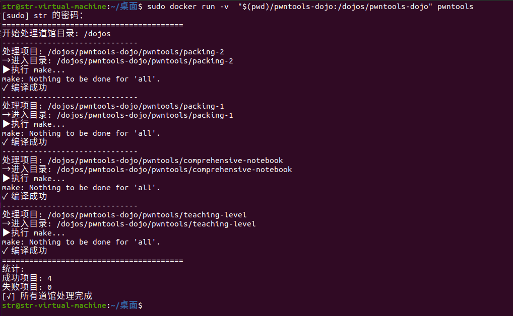

# dojo_auto_compilation

自动编译道馆中用 C 语言编写的挑战，因为这些挑战将在挑战 Docker 容器中执行。请注意，此仓库将根据挑战的 Dockerfile 进行更新。

## 运行

以 `pwntools-dojo` 仓库为例，在 Dockerfile 所在的目录下构建镜像，再执行运行容器，此时会在有Makefile的目录自动执行‘make’指令。

```
sudo docker build -t pwntools
sudo docker run -v "$(pwd)/pwntools-dojo:/dojos/pwntools-dojo:shared" pwntools
```

成功运行的结果如图：

